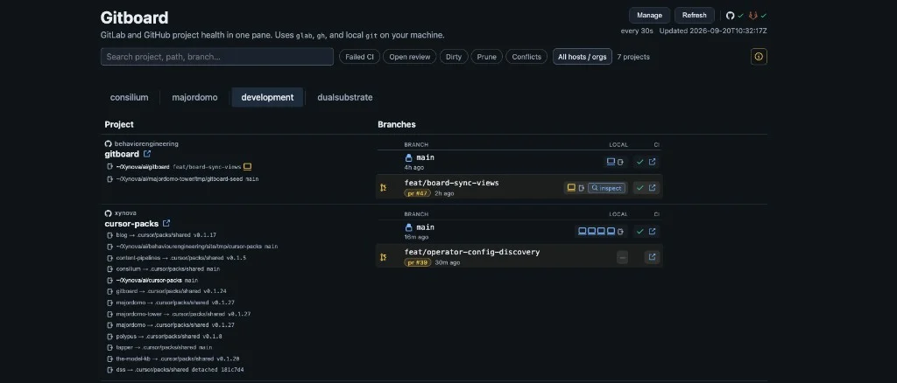

# Gitboard



Local code-change board for GitLab and GitHub: CI status, open MRs/PRs, failed job triage, and local checkout / worktree state. Uses `gh`, `glab`, and `git` on your machine (not deployments or runtime ops).

## Quick start

```bash
brew install glab process-compose
glab auth login
gh auth login
make init
# edit ~/.config/gitboard/config.yaml llm section if needed
make sync
make serve
```

Open [http://127.0.0.1:1325/](http://127.0.0.1:1325/). Stop with `make serve-down`.

`make serve` runs a **process-compose** TUI (same idea as Polypus). The CLI `gitboard serve` still works for one-off runs without the TUI.

## Config

User config lives at `~/.config/gitboard/config.yaml` (or `$XDG_CONFIG_HOME/gitboard/config.yaml`).

| Section | Purpose |
|---------|---------|
| `llm` | Optional AI triage (`base_url`, `model`, `api_key`) |
| `ui` | Dashboard settings (`poll_seconds`, default 30; `0` disables) |
| `local` | Disk roots to scan for checkouts / worktrees (`roots`) |
| `sync` | GitHub orgs and GitLab groups to discover |
| `projects` | Curated tracked repos (written by `sync`; optional `local_path`) |

Override path with `GITBOARD_CONFIG`. LLM fields also accept env overrides: `GITBOARD_LLM_BASE_URL`, `GITBOARD_LLM_MODEL`, `GITBOARD_LLM_API_KEY`, `POLYPUS_BASE_URL`, `OPENAI_API_KEY`. Poll interval: `GITBOARD_POLL_SECONDS`.

## Commands

| Command | Purpose |
|---------|---------|
| `gitboard init` / `make init` | Create config if missing (never overwrite) |
| `gitboard sync` / `make sync` | Discover repos, select which to track, write `projects` |
| `make serve` | process-compose TUI on `:1325`; rebuilds/restarts when `.go` or static UI files change |
| `make serve-down` | Stop this Gitboard process-compose project |
| `gitboard serve` | Direct dashboard (no process-compose) |

Sync helpers: `--add owner/repo --host github|gitlab`, `--remove id`, `--dry-run`, `--host github|gitlab`.

`make sync` uses an interactive TUI (Charm huh): arrow keys, space to toggle, `/` to filter, enter to confirm. Already-tracked repos start checked.

The Branches column lists remote heads from the forge (up to 20): default and open PR/MR first, then other remotes by recency. Each branch shows its own latest CI (status + run link). CI-only refs still do not invent branch rows.

## Local checkouts

Set `local.roots` to directories that contain clones (including nested submodules and linked worktrees). Gitboard matches `origin` remotes to tracked `host`/`path`.

Per-project override:

```yaml
projects:
  - id: gitboard
    label: gitboard
    host: github
    path: behaviorengineering/gitboard
    local_path: ~/Xynova/ai/gitboard
```

The Local status sits beside each remote branch (laptop icon when checked out locally, dirty, and ↑/↓ versus origin for every local branch that has `origin/<name>`). When a branch is behind origin and the tree is clean, **pull** fast-forwards it (`git pull --ff-only`, or `git fetch origin branch:branch` when that branch is not checked out). Worktrees on branches with no remote head appear as “local only” rows.

## strop (submodule + workspace)

[strop](https://github.com/behaviorengineering/strop) lives at `providers/strop` as a git submodule. Root `go.work` wires it so `go build` / `go test` use that tree instead of the module cache.

```bash
git clone --recurse-submodules https://github.com/behaviorengineering/gitboard.git
# or after clone:
git submodule update --init --recursive
```

To move to a new strop release:

```bash
cd providers/strop && git fetch && git checkout vX.Y.Z && cd ../..
go get github.com/behaviorengineering/strop@vX.Y.Z
go work sync
git add providers/strop go.mod go.sum go.work go.work.sum
```

## Design

| Layer | Choice |
|-------|--------|
| GitHub | [`gh`](https://cli.github.com/) |
| GitLab | [`glab`](https://gitlab.com/gitlab-org/cli) |
| Auth | Existing CLI login sessions |
| AI triage | Optional OpenAI-compatible chat in `llm` |
| Supervision | process-compose (`make serve`) |

## API

| Method | Path | Purpose |
|--------|------|---------|
| `GET` | `/api/health` | Liveness |
| `GET` | `/api/dashboard` | Aggregated rows |
| `GET` | `/api/failures?project=&run_id=` | Failed jobs |
| `POST` | `/api/triage` | AI log analysis |
| `POST` | `/api/prune/safe` | Re-check hints and remove a safe local checkout |
| `POST` | `/api/pull/ff` | Fast-forward a local branch from origin (ff-only) |
| `POST` | `/api/agents/prune/investigate` | Likely-removable branch evidence + session card |
| `GET` | `/api/agents/sessions/:id` | Session meta, card, turns |
| `GET` | `/api/agents/sessions/:id/failure` | Failure dump attachment when present |
