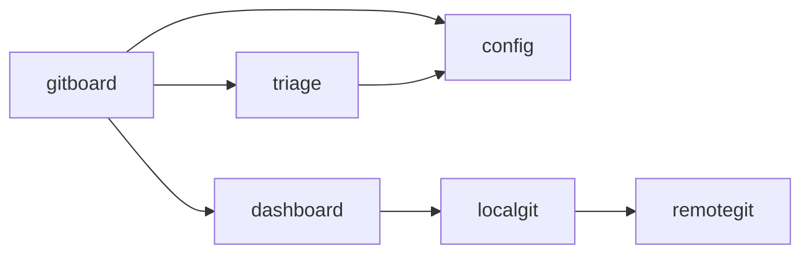

# Architecture

> **Teaching story.** Living project architecture for humans and review grounding.

Gitboard is organized into functional slices that separate local filesystem management, remote forge interaction, and user interface concerns.

## Bounded Contexts

### Gitboard (Orchestration)
The central orchestrator that manages the lifecycle from local discovery to remote synchronization. It owns the core domain logic for board management.
- **Key Components**: `internal/board`, `cmd/gitboard`.

### Config (System Settings)
A centralized provider for all component settings, including LLM credentials and UI preferences.
- **Key Components**: `internal/config`.

### Dashboard (Visual Interface)
The web-based management interface used to monitor project status and trigger remote actions.
- **Key Components**: `internal/dashboard` (UI surface).

### LocalGit (Filesystem)
Manages direct interactions with the local filesystem, specifically inspecting git worktrees and clones.
- **Key Components**: `internal/localgit`.

### RemoteGit (Forge Integration)
Facilitates communication with GitHub and GitLab to synchronize remote state.
- **Key Components**: `internal/remotegit`, `internal/cliexec`.

### Triage (Agentic Workflows)
Automates repository analysis and pruning using LLM-driven agentic workflows.
- **Key Components**: `internal/triage`, `internal/pruneagent`, `internal/llm`.

## Component Map

## Boundary Debt
Current implementation shows several cross-slice imports that are not yet formally declared in the slice bindings, particularly between the `dashboard` and `remotegit` slices, and between the `triage` components and `localgit`.
