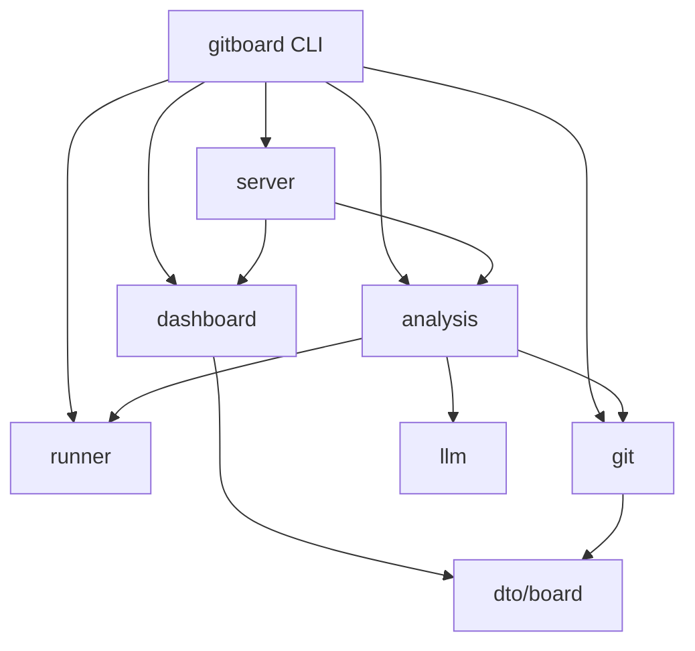

# Architecture

<!-- majordomo-reading-nav:start -->
**Reading path:** [Prev: mission.md](mission.md) · [Next: conventions.md](conventions.md) · [TOC](README.md)
<!-- majordomo-reading-nav:end -->

> **Teaching story.** Living project architecture for humans and review grounding.

Gitboard is organized into functional slices that separate forge interaction, data representation, and user interface orchestration.

## Bounded Contexts

### Orchestration &amp; Entrypoint
- **`gitboard`**: The primary CLI entrypoint that orchestrates the various system components.

### Data &amp; Domain
- **`dto/board`**: The central data contract. Provides shared JSON types used by the dashboard, forge adapters, and the server.
- **`git`**: The forge abstraction layer. Manages interactions with GitHub and GitLab via `localgit` and `remotegit` adapters.
- **`runner`**: A low-level utility for executing external system processes via `os/exec`.

### Intelligence &amp; Analysis
- **`analysis`**: The triage engine. Analyzes project and job data to generate actionable insights (e.g., via `pruneagent` and `triage`).
- **`llm`**: Provides an OpenAI-compatible interface for AI-augmented triage and analysis.

### User Interface &amp; Presentation
- **`dashboard`**: An aggregator slice that composes various views and investigation results for the user.
- **`server`**: The HTTP interface providing the web-based dashboard UI.
- **`syncproj`**: Manages the discovery and selection of projects to be tracked.

### Infrastructure
- **`observability`**: Manages telemetry and error-only inference dumps.
- **`config`**: A shared technical library for application configuration.

## Component Map

