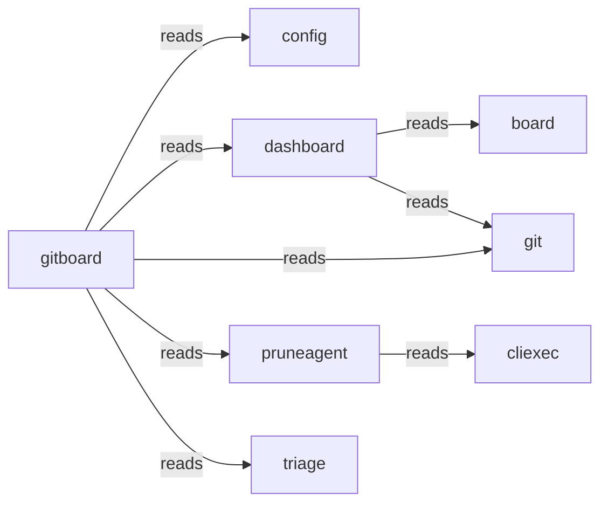

# Typology Architecture Brief

<!-- typology:generated -->

This document is a human-readable projection of the confirmed Typology catalog and the observed Go repository. The catalog remains the machine source of truth. This brief helps people inspect whether the design matches the code.

## How to read this brief

The **intended architecture** comes from the catalog. The **observed topology** comes from the Go import graph. Findings name evidence that needs an agent or architect to fix or record as boundary debt. Typology does not infer a final design decision from a finding.

## Intended architecture

### Bounded-context map

### Bounded contexts

| Slice | Objective | Route |
|-------|-----------|-------|
| `gitboard` | Orchestrates the gitboard ecosystem by providing a unified CLI for repository management and automation. |  |
| `board` | Manages the visual representation and state of project boards for user review. |  |
| `config` | Provides centralized configuration management for all gitboard components and environments. |  |
| `dashboard` | Serves as the primary web-based interface for monitoring and interacting with gitboard data. |  |
| `git` | Handles all low-level git operations for both local and remote repository interactions. |  |
| `cliexec` | Provides a reusable execution adapter for running external processes within the CLI context. |  |
| `pruneagent` | Automates the identification and cleanup of stale repository branches and artifacts. |  |
| `triage` | Analyzes repository changes to assist users in decision-making for branch maintenance. |  |

### Context details

#### `gitboard`

Orchestrates the gitboard ecosystem by providing a unified CLI for repository management and automation.

- Packages: ./internal/llm, ./cmd/gitboard, ./internal/observability, ./internal/server, ./internal/syncproj
- Surfaces: gitboard-cli (cli)
- Programs: _(none)_

#### `board`

Manages the visual representation and state of project boards for user review.

- Packages: ./internal/board
- Surfaces: _(none)_
- Programs: _(none)_

#### `config`

Provides centralized configuration management for all gitboard components and environments.

- Packages: ./internal/config
- Surfaces: _(none)_
- Programs: _(none)_

#### `dashboard`

Serves as the primary web-based interface for monitoring and interacting with gitboard data.

- Packages: ./internal/dashboard
- Surfaces: dashboard-ui (ui)
- Programs: _(none)_

#### `git`

Handles all low-level git operations for both local and remote repository interactions.

- Packages: ./internal/localgit, ./internal/remotegit
- Surfaces: _(none)_
- Programs: _(none)_

#### `cliexec`

Provides a reusable execution adapter for running external processes within the CLI context.

- Packages: ./internal/cliexec
- Surfaces: _(none)_
- Programs: _(none)_

#### `pruneagent`

Automates the identification and cleanup of stale repository branches and artifacts.

- Packages: ./internal/pruneagent
- Surfaces: _(none)_
- Programs: _(none)_

#### `triage`

Analyzes repository changes to assist users in decision-making for branch maintenance.

- Packages: ./internal/triage
- Surfaces: _(none)_
- Programs: _(none)_

### Declared coupling

| From | To | Kind |
|------|----|------|
| `gitboard` | `config` | reads |
| `gitboard` | `dashboard` | reads |
| `gitboard` | `git` | reads |
| `gitboard` | `pruneagent` | reads |
| `gitboard` | `triage` | reads |
| `dashboard` | `board` | reads |
| `dashboard` | `git` | reads |
| `pruneagent` | `cliexec` | reads |

No component bindings are declared.

## Observed topology

The repository contains **13 Go packages** in the inspected modules:
- `./cmd/gitboard`
- `./internal/board`
- `./internal/cliexec`
- `./internal/config`
- `./internal/dashboard`
- `./internal/llm`
- `./internal/localgit`
- `./internal/observability`
- `./internal/pruneagent`
- `./internal/remotegit`
- `./internal/server`
- `./internal/syncproj`
- `./internal/triage`

### High-coupling packages

| Package | In-degree | Out-degree |
|---------|-----------|------------|
| `./cmd/gitboard` | 0 | 11 |
| `./internal/cliexec` | 4 | 0 |
| `./internal/config` | 7 | 0 |
| `./internal/dashboard` | 2 | 4 |
| `./internal/llm` | 3 | 1 |
| `./internal/localgit` | 3 | 1 |
| `./internal/remotegit` | 3 | 3 |
| `./internal/server` | 1 | 4 |

### Leaf packages

Leaf packages have no outgoing local imports. They may be valid infrastructure leaves or packages that should sit inside their only caller.

| Package | Imported by |
|---------|-------------|
| `./internal/board` | 2 |
| `./internal/cliexec` | 4 |
| `./internal/config` | 7 |
| `./internal/observability` | 1 |

### Shared platform leaves

./internal/config

### Merge candidates

These are heuristics for review, not automatic moves.

- `./internal/observability` may sit with `./cmd/gitboard`: sole importer: only imported by ./cmd/gitboard
- `./internal/server` may sit with `./cmd/gitboard`: sole importer: only imported by ./cmd/gitboard
- `./internal/syncproj` may sit with `./cmd/gitboard`: sole importer: only imported by ./cmd/gitboard

## Drift and design questions

The following findings need a correction or an explicit boundary-debt decision:

- `dashboard`: SliceBinding dashboard -> config missing but cross-slice import exists (internal-dashboard -> internal-config)
- `git`: SliceBinding git -> board missing but cross-slice import exists (internal-remotegit -> internal-board)
- `git`: SliceBinding git -> cliexec missing but cross-slice import exists (internal-localgit -> internal-cliexec)
- `git`: SliceBinding git -> cliexec missing but cross-slice import exists (internal-remotegit -> internal-cliexec)
- `git`: SliceBinding git -> config missing but cross-slice import exists (internal-remotegit -> internal-config)
- `gitboard`: SliceBinding gitboard -> cliexec missing but cross-slice import exists (cmd-gitboard -> internal-cliexec)
- `pruneagent`: SliceBinding pruneagent -> git missing but cross-slice import exists (internal-pruneagent -> internal-localgit)
- `pruneagent`: SliceBinding pruneagent -> gitboard missing but cross-slice import exists (internal-pruneagent -> internal-llm)
- `triage`: SliceBinding triage -> config missing but cross-slice import exists (internal-triage -> internal-config)
- `triage`: SliceBinding triage -> gitboard missing but cross-slice import exists (internal-triage -> internal-llm)

## Agent review protocol

1. Read the relevant catalog rows and the evidence named by each finding.
2. Fix the code or catalog when the boundary is wrong.
3. Record a temporary boundary decision in the Typology journey when the design needs a later refactor.
4. Re-run `typology architecture REPO` and `typology validate REPO`.
5. Remove the generated marker only after a human accepts the narrative as a reviewed explanation.
