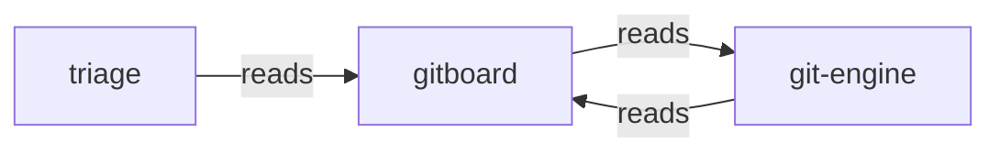

# Typology Architecture Brief

<!-- typology:generated -->

This document is a human-readable projection of the confirmed Typology catalog and the observed Go repository. The catalog remains the machine source of truth. This brief helps people inspect whether the design matches the code.

## How to read this brief

The **intended architecture** comes from the catalog. The **observed topology** comes from the Go import graph. Findings name evidence that needs an agent or architect to fix or record as boundary debt. Typology does not infer a final design decision from a finding.

## Intended architecture

### Bounded-context map

### Bounded contexts

| Slice | Objective | Route |
|-------|-----------|-------|
| `gitboard` | Core domain managing gitboard operations, orchestration, and primary interfaces. |  |
| `git-engine` | Low-level git primitives for local and remote repository manipulation. |  |
| `triage` | Automated workflow for analyzing and categorizing repository changes. |  |

### Context details

#### `gitboard`

Core domain managing gitboard operations, orchestration, and primary interfaces.

- Packages: ./internal/board, ./internal/config, ./internal/observability, ./internal/server, ./internal/syncproj, ./internal/pruneagent, ./cmd/gitboard, ./internal/dashboard
- Surfaces: gitboard-cli (cli), gitboard-ui (ui)
- Programs: 

#### `git-engine`

Low-level git primitives for local and remote repository manipulation.

- Packages: ./internal/localgit, ./internal/remotegit
- Surfaces: 
- Programs: 

#### `triage`

Automated workflow for analyzing and categorizing repository changes.

- Packages: ./internal/triage, ./internal/llm
- Surfaces: 
- Programs: 

### Declared coupling

| From | To | Kind |
|------|----|------|
| `git-engine` | `gitboard` | reads |
| `gitboard` | `git-engine` | reads |
| `triage` | `gitboard` | reads |

No component bindings are declared.

## Observed topology

The repository contains **13 Go packages** in the inspected modules:
- `.`

### High-coupling packages

| Package | In-degree | Out-degree |
|---------|-----------|------------|
| `./cmd/gitboard` | 0 | 11 |
| `./internal/cliexec` | 4 | 0 |
| `./internal/config` | 7 | 0 |
| `./internal/dashboard` | 2 | 4 |
| `./internal/llm` | 3 | 1 |
| `./internal/localgit` | 3 | 1 |
| `./internal/remotegit` | 3 | 3 |
| `./internal/server` | 1 | 4 |

### Leaf packages

Leaf packages have no outgoing local imports. They may be valid infrastructure leaves or packages that should sit inside their only caller.

| Package | Imported by |
|---------|-------------|
| `./internal/board` | 2 |
| `./internal/cliexec` | 4 |
| `./internal/config` | 7 |
| `./internal/observability` | 1 |

### Shared platform leaves

./internal/config

### Merge candidates

These are heuristics for review, not automatic moves.

- `./internal/observability` may sit with `./cmd/gitboard`: sole importer: only imported by ./cmd/gitboard
- `./internal/server` may sit with `./cmd/gitboard`: sole importer: only imported by ./cmd/gitboard
- `./internal/syncproj` may sit with `./cmd/gitboard`: sole importer: only imported by ./cmd/gitboard

## Drift and design questions

The following findings need a correction or an explicit boundary-debt decision:

- unmapped package "internal/cliexec" in module; not claimed by any slice in owns[] or surfaces[]
- `git-engine`: DocPage components path missing: docs/develop/git-engine/components.md
- `git-engine`: DocPage overview path missing: docs/develop/git-engine/overview.md
- `gitboard`: DocPage components path missing: docs/develop/gitboard/components.md
- `gitboard`: DocPage overview path missing: docs/develop/gitboard/overview.md
- `gitboard`: SliceBinding gitboard -> triage missing but cross-slice import exists (cmd-gitboard -> internal-llm)
- `gitboard`: SliceBinding gitboard -> triage missing but cross-slice import exists (cmd-gitboard -> internal-triage)
- `gitboard`: SliceBinding gitboard -> triage missing but cross-slice import exists (gitboard-prune-worker -> internal-llm)
- `gitboard`: SliceBinding gitboard -> triage missing but cross-slice import exists (internal-server -> internal-triage)
- `triage`: DocPage components path missing: docs/develop/triage/components.md
- `triage`: DocPage overview path missing: docs/develop/triage/overview.md

## Agent review protocol

1. Read the relevant catalog rows and the evidence named by each finding.
2. Fix the code or catalog when the boundary is wrong.
3. Record a temporary boundary decision in the Typology journey when the design needs a later refactor.
4. Re-run `typology architecture REPO` and `typology validate REPO`.
5. Remove the generated marker only after a human accepts the narrative as a reviewed explanation.
