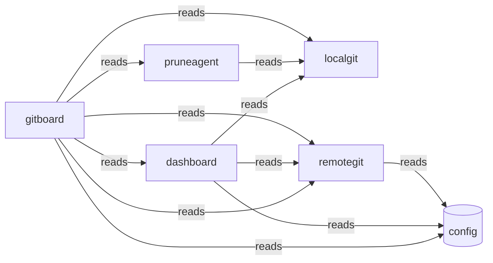

# Typology Architecture Brief

> **Typology seed evidence.** Post-survey/refine architecture brief for this context digest proposal. Not the teaching-story root `architecture.md`, and not the confirmed `.typology/` catalog.

<!-- typology:generated -->

This document is a human-readable projection of the confirmed Typology catalog and the observed Go repository. The catalog remains the machine source of truth. This brief helps people inspect whether the design matches the code.

## How to read this brief

The **intended architecture** comes from the catalog. The **observed topology** comes from the Go import graph. Findings name evidence that needs an agent or architect to fix or record as boundary debt. Typology does not infer a final design decision from a finding.

## Intended architecture

### Bounded-context map

### Bounded contexts

| Slice | Objective | Route |
|-------|-----------|-------|
| `gitboard` | Manages the end-to-end lifecycle of git repository discovery, synchronization, and triage. |  |
| `dashboard` | Provides a visual interface and data model for monitoring git state and project status. |  |
| `localgit` | Manages local filesystem git state and worktree inspections. |  |
| `remotegit` | Interfaces with GitHub and GitLab APIs to fetch remote repository metadata. |  |
| `pruneagent` | Investigates local branches to identify likely removable or stale worktrees. |  |

### Libraries

Technical packages with no domain knowledge. They claim packages without a product objective.

| Library | Purpose | Packages |
|---------|---------|----------|
| `config` | Shared technical package for application configuration. | internal/config |

### Context details

#### `gitboard`

Manages the end-to-end lifecycle of git repository discovery, synchronization, and triage.

- Packages: internal/syncproj, internal/triage, internal/cliexec, internal/llm, internal/observability, cmd/gitboard
- Surfaces: gitboard-cli (cli)
- Programs: _(none)_

#### `dashboard`

Provides a visual interface and data model for monitoring git state and project status.

- Packages: internal/board, internal/server, internal/dashboard
- Surfaces: dashboard-server (api), dashboard-ui (ui)
- Programs: _(none)_

#### `localgit`

Manages local filesystem git state and worktree inspections.

- Packages: internal/localgit
- Surfaces: _(none)_
- Programs: _(none)_

#### `remotegit`

Interfaces with GitHub and GitLab APIs to fetch remote repository metadata.

- Packages: internal/remotegit
- Surfaces: _(none)_
- Programs: _(none)_

#### `pruneagent`

Investigates local branches to identify likely removable or stale worktrees.

- Packages: internal/pruneagent
- Surfaces: _(none)_
- Programs: _(none)_

### Declared coupling

| From | To | Kind |
|------|----|------|
| `gitboard` | `config` | reads |
| `gitboard` | `remotegit` | reads |
| `dashboard` | `config` | reads |
| `dashboard` | `localgit` | reads |
| `dashboard` | `remotegit` | reads |
| `pruneagent` | `localgit` | reads |
| `remotegit` | `config` | reads |
| `gitboard` | `dashboard` | reads |
| `gitboard` | `localgit` | reads |
| `gitboard` | `pruneagent` | reads |
| `gitboard` | `remotegit` | reads |

Bindings may target a slice or a library. `from` is always a slice.

No component bindings are declared.

## Observed topology

The repository contains **13 Go packages** in the inspected modules:
- `./cmd/gitboard`
- `./internal/board`
- `./internal/cliexec`
- `./internal/config`
- `./internal/dashboard`
- `./internal/llm`
- `./internal/localgit`
- `./internal/observability`
- `./internal/pruneagent`
- `./internal/remotegit`
- `./internal/server`
- `./internal/syncproj`
- `./internal/triage`

### High-coupling packages

| Package | In-degree | Out-degree |
|---------|-----------|------------|
| `./cmd/gitboard` | 0 | 11 |
| `./internal/cliexec` | 4 | 0 |
| `./internal/config` | 7 | 0 |
| `./internal/dashboard` | 2 | 4 |
| `./internal/llm` | 3 | 1 |
| `./internal/localgit` | 3 | 1 |
| `./internal/remotegit` | 3 | 3 |
| `./internal/server` | 1 | 4 |

### Leaf packages

Leaf packages have no outgoing local imports. They may be valid infrastructure leaves or packages that should sit inside their only caller.

| Package | Imported by |
|---------|-------------|
| `./internal/board` | 2 |
| `./internal/cliexec` | 4 |
| `./internal/config` | 7 |
| `./internal/observability` | 1 |

### Shared platform leaves

./internal/config

### Merge candidates

These are heuristics for review, not automatic moves.

- `./internal/observability` may sit with `./cmd/gitboard`: sole importer: only imported by ./cmd/gitboard
- `./internal/server` may sit with `./cmd/gitboard`: sole importer: only imported by ./cmd/gitboard
- `./internal/syncproj` may sit with `./cmd/gitboard`: sole importer: only imported by ./cmd/gitboard

## Drift and design questions

The following findings need a correction or an explicit boundary-debt decision:

- `dashboard`: SliceBinding dashboard -> gitboard missing but cross-slice import exists (internal-server -> triage)
- `dashboard`: SliceBinding dashboard -> pruneagent missing but cross-slice import exists (internal-server -> internal-pruneagent)
- `localgit`: SliceBinding localgit -> gitboard missing but cross-slice import exists (internal-localgit -> internal-cliexec)
- `pruneagent`: SliceBinding pruneagent -> gitboard missing but cross-slice import exists (internal-pruneagent -> internal-cliexec)
- `pruneagent`: SliceBinding pruneagent -> gitboard missing but cross-slice import exists (internal-pruneagent -> internal-llm)
- `remotegit`: SliceBinding remotegit -> dashboard missing but cross-slice import exists (internal-remotegit -> board-dto)
- `remotegit`: SliceBinding remotegit -> gitboard missing but cross-slice import exists (internal-remotegit -> internal-cliexec)

## Agent review protocol

1. Read the relevant catalog rows and the evidence named by each finding.
2. Fix the code or catalog when the boundary is wrong.
3. Record a temporary boundary decision in the Typology journey when the design needs a later refactor.
4. Re-run `typology architecture REPO` and `typology validate REPO`.
5. Remove the generated marker only after a human accepts the narrative as a reviewed explanation.
