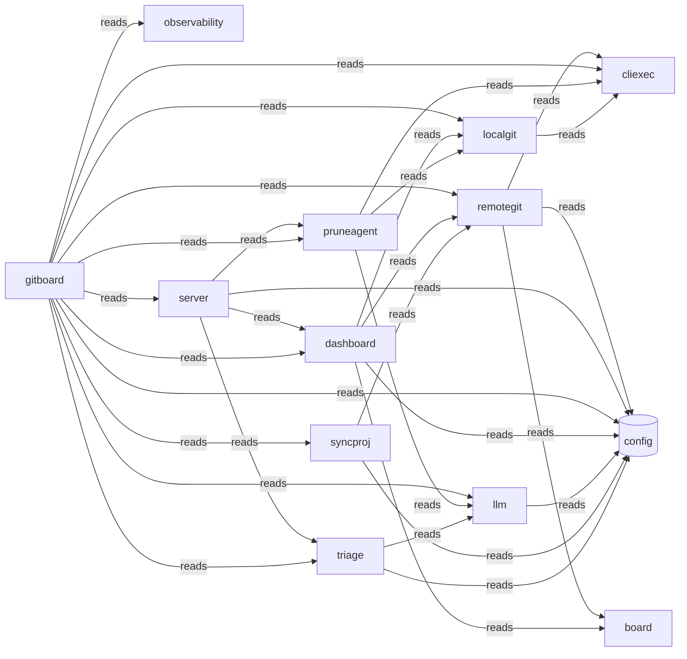

# Typology Architecture Brief

<!-- majordomo-reading-nav:start -->
**Reading path:** [Prev: README.md](README.md) · [Next: cluster_proposal.md](cluster_proposal.md) · [TOC](README.md)
<!-- majordomo-reading-nav:end -->

> **Typology seed evidence.** Post-survey/refine architecture brief for this context digest proposal. Not the teaching-story root `architecture.md`, and not the confirmed `.typology/` catalog.

<!-- typology:generated -->

This document is a human-readable projection of the confirmed Typology catalog and the observed Go repository. The catalog remains the machine source of truth. This brief helps people inspect whether the design matches the code.

## How to read this brief

The **intended architecture** comes from the catalog. The **observed topology** comes from the Go import graph. Findings name evidence that needs an agent or architect to fix or record as boundary debt. Typology does not infer a final design decision from a finding.

## Intended architecture

### Bounded-context map

### Bounded contexts

| Slice | Objective | Route |
|-------|-----------|-------|
| `board` | internal/board defines the JSON data shapes shared across the dashboard UI and forge adapters. |  |
| `cliexec` | The package provides a runner interface for executing external processes. |  |
| `dashboard` | The package provides mechanisms to collect and investigate synchronization and pull request data. |  |
| `gitboard` | The package serves as a command-line entrypoint for the gitboard application. |  |
| `llm` | The package provides an OpenAI-compatible chat completions client to interface with external LLM services. |  |
| `localgit` | The package provides capabilities for inspecting local git worktrees and synchronizing branch states. |  |
| `observability` | The package bootstraps OpenTelemetry and manages error-only inference dumps via a failure dump processor. |  |
| `pruneagent` | The package investigates and decides the lifecycle status of local-only or removable branches. |  |
| `remotegit` | The package adapts external Git provider data into internal board DTOs. |  |
| `server` | The server package provides HTTP services and initializes request multiplexing. |  |
| `syncproj` | The package aggregates project information from external forges like GitHub and GitLab. |  |
| `triage` | The package provides an Analyzer to process job and log information via a Request/Response pattern. |  |

### Libraries

Technical packages with no domain knowledge. They claim packages without a product objective.

| Library | Purpose | Packages |
|---------|---------|----------|
| `config` | Shared technical package without domain knowledge | internal/config |

### Context details

#### `board`

internal/board defines the JSON data shapes shared across the dashboard UI and forge adapters.

- Packages: internal/board
- Surfaces: _(none)_
- Programs: _(none)_

#### `cliexec`

The package provides a runner interface for executing external processes.

- Packages: internal/cliexec
- Surfaces: _(none)_
- Programs: _(none)_

#### `dashboard`

The package provides mechanisms to collect and investigate synchronization and pull request data.

- Packages: internal/dashboard
- Surfaces: _(none)_
- Programs: _(none)_

#### `gitboard`

The package serves as a command-line entrypoint for the gitboard application.

- Packages: cmd/gitboard
- Surfaces: gitboard-cli (cli)
- Programs: _(none)_

#### `llm`

The package provides an OpenAI-compatible chat completions client to interface with external LLM services.

- Packages: internal/llm
- Surfaces: _(none)_
- Programs: _(none)_

#### `localgit`

The package provides capabilities for inspecting local git worktrees and synchronizing branch states.

- Packages: internal/localgit
- Surfaces: _(none)_
- Programs: _(none)_

#### `observability`

The package bootstraps OpenTelemetry and manages error-only inference dumps via a failure dump processor.

- Packages: internal/observability
- Surfaces: _(none)_
- Programs: _(none)_

#### `pruneagent`

The package investigates and decides the lifecycle status of local-only or removable branches.

- Packages: internal/pruneagent
- Surfaces: _(none)_
- Programs: _(none)_

#### `remotegit`

The package adapts external Git provider data into internal board DTOs.

- Packages: internal/remotegit
- Surfaces: _(none)_
- Programs: _(none)_

#### `server`

The server package provides HTTP services and initializes request multiplexing.

- Packages: internal/server
- Surfaces: server-ui (ui)
- Programs: _(none)_

#### `syncproj`

The package aggregates project information from external forges like GitHub and GitLab.

- Packages: internal/syncproj
- Surfaces: _(none)_
- Programs: _(none)_

#### `triage`

The package provides an Analyzer to process job and log information via a Request/Response pattern.

- Packages: internal/triage
- Surfaces: _(none)_
- Programs: _(none)_

### Declared coupling

| From | To | Kind |
|------|----|------|
| `remotegit` | `board` | reads |
| `remotegit` | `cliexec` | reads |
| `remotegit` | `config` | reads |
| `server` | `config` | reads |
| `server` | `dashboard` | reads |
| `server` | `pruneagent` | reads |
| `server` | `triage` | reads |
| `gitboard` | `cliexec` | reads |
| `gitboard` | `config` | reads |
| `gitboard` | `dashboard` | reads |
| `gitboard` | `llm` | reads |
| `gitboard` | `localgit` | reads |
| `gitboard` | `observability` | reads |
| `gitboard` | `pruneagent` | reads |
| `gitboard` | `remotegit` | reads |
| `gitboard` | `server` | reads |
| `gitboard` | `syncproj` | reads |
| `gitboard` | `triage` | reads |
| `dashboard` | `board` | reads |
| `dashboard` | `config` | reads |
| `dashboard` | `localgit` | reads |
| `dashboard` | `remotegit` | reads |
| `llm` | `config` | reads |
| `pruneagent` | `cliexec` | reads |
| `pruneagent` | `llm` | reads |
| `pruneagent` | `localgit` | reads |
| `syncproj` | `config` | reads |
| `syncproj` | `remotegit` | reads |
| `triage` | `config` | reads |
| `triage` | `llm` | reads |
| `localgit` | `cliexec` | reads |

Bindings may target a slice or a library. `from` is always a slice.

No component bindings are declared.

## Observed topology

The repository contains **13 Go packages** in the inspected modules:
- `./cmd/gitboard`
- `./internal/board`
- `./internal/cliexec`
- `./internal/config`
- `./internal/dashboard`
- `./internal/llm`
- `./internal/localgit`
- `./internal/observability`
- `./internal/pruneagent`
- `./internal/remotegit`
- `./internal/server`
- `./internal/syncproj`
- `./internal/triage`

### High-coupling packages

| Package | In-degree | Out-degree |
|---------|-----------|------------|
| `./cmd/gitboard` | 0 | 11 |
| `./internal/cliexec` | 4 | 0 |
| `./internal/config` | 7 | 0 |
| `./internal/dashboard` | 2 | 4 |
| `./internal/llm` | 3 | 1 |
| `./internal/localgit` | 3 | 1 |
| `./internal/remotegit` | 3 | 3 |
| `./internal/server` | 1 | 4 |

### Leaf packages

Leaf packages have no outgoing local imports. They may be valid infrastructure leaves or packages that should sit inside their only caller.

| Package | Imported by |
|---------|-------------|
| `./internal/board` | 2 |
| `./internal/cliexec` | 4 |
| `./internal/config` | 7 |
| `./internal/observability` | 1 |

### Shared platform leaves

./internal/config

### Merge candidates

These are heuristics for review, not automatic moves.

- `./internal/observability` may sit with `./cmd/gitboard`: sole importer: only imported by ./cmd/gitboard
- `./internal/server` may sit with `./cmd/gitboard`: sole importer: only imported by ./cmd/gitboard
- `./internal/syncproj` may sit with `./cmd/gitboard`: sole importer: only imported by ./cmd/gitboard

## Drift and design questions

No catalog, path, import, or documentation findings were reported.

## Agent review protocol

1. Read the relevant catalog rows and the evidence named by each finding.
2. Fix the code or catalog when the boundary is wrong.
3. Record a temporary boundary decision in the Typology journey when the design needs a later refactor.
4. Re-run `typology architecture REPO` and `typology validate REPO`.
5. Remove the generated marker only after a human accepts the narrative as a reviewed explanation.
