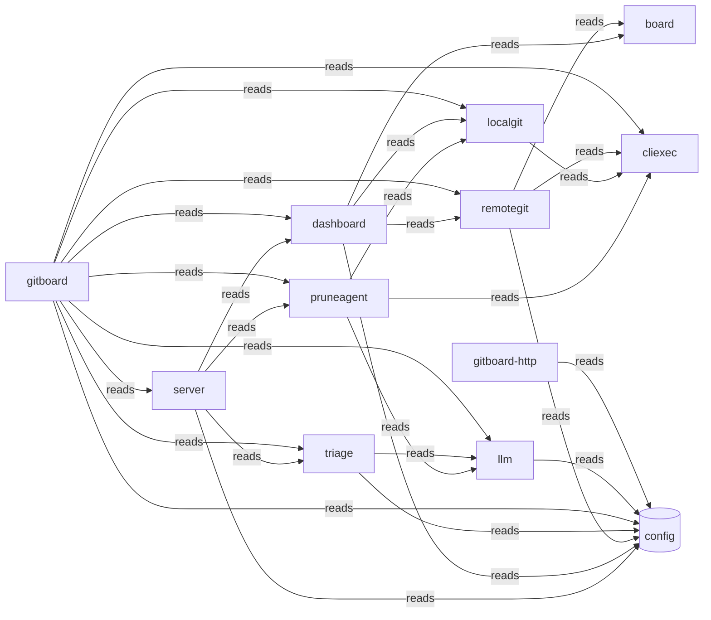

# Typology Architecture Brief

<!-- majordomo-reading-nav:start -->
**Reading path:** [Prev: README.md](README.md) · [Next: cluster_proposal.md](cluster_proposal.md) · [TOC](README.md)
<!-- majordomo-reading-nav:end -->

> **Typology seed evidence.** Post-survey/refine architecture brief for this context digest proposal. Not the teaching-story root `architecture.md`, and not the confirmed `.typology/` catalog.

<!-- typology:generated -->

This document is a human-readable projection of the confirmed Typology catalog and the observed Go repository. The catalog remains the machine source of truth. This brief helps people inspect whether the design matches the code.

## How to read this brief

The **intended architecture** comes from the catalog. The **observed topology** comes from the Go import graph. Findings name evidence that needs an agent or architect to fix or record as boundary debt. Typology does not infer a final design decision from a finding.

## Intended architecture

### Bounded-context map

### Bounded contexts

| Slice | Objective | Route |
|-------|-----------|-------|
| `board` | Provides shared JSON data structures for cross-component state synchronization. |  |
| `cliexec` | Manages the execution of external system processes and shell commands. |  |
| `dashboard` | Aggregates local and remote git data into a unified view for user interaction. |  |
| `gitboard` | Orchestrates the local code-change board via CLI and background synchronization. |  |
| `llm` | Provides OpenAI-compatible chat completion capabilities for automated triage. |  |
| `localgit` | Interacts with the local filesystem to inspect and manage git worktrees and branches. |  |
| `pruneagent` | Analyzes local branch state to identify candidates for removal. |  |
| `remotegit` | Interfaces with GitHub and GitLab APIs to fetch remote repository metadata. |  |
| `server` | Serves the dashboard web interface via an HTTP server. |  |
| `triage` | Performs automated analysis of failed jobs and open items using LLM intelligence. |  |
| `gitboard-http` | HTTP delivery surface separated from the CLI entrypoint. |  |

### Libraries

Technical packages with no domain knowledge. They claim packages without a product objective.

| Library | Purpose | Packages |
|---------|---------|----------|
| `config` | Provides shared configuration loading and access for the entire application. | internal/config |

### Context details

#### `board`

Provides shared JSON data structures for cross-component state synchronization.

- Packages: internal/board
- Surfaces: _(none)_
- Programs: _(none)_

#### `cliexec`

Manages the execution of external system processes and shell commands.

- Packages: internal/cliexec
- Surfaces: _(none)_
- Programs: _(none)_

#### `dashboard`

Aggregates local and remote git data into a unified view for user interaction.

- Packages: internal/dashboard
- Surfaces: _(none)_
- Programs: _(none)_

#### `gitboard`

Orchestrates the local code-change board via CLI and background synchronization.

- Packages: internal/observability, internal/syncproj, cmd/gitboard
- Surfaces: gitboard-cli (cli)
- Programs: _(none)_

#### `llm`

Provides OpenAI-compatible chat completion capabilities for automated triage.

- Packages: internal/llm
- Surfaces: _(none)_
- Programs: _(none)_

#### `localgit`

Interacts with the local filesystem to inspect and manage git worktrees and branches.

- Packages: internal/localgit
- Surfaces: _(none)_
- Programs: _(none)_

#### `pruneagent`

Analyzes local branch state to identify candidates for removal.

- Packages: internal/pruneagent
- Surfaces: _(none)_
- Programs: _(none)_

#### `remotegit`

Interfaces with GitHub and GitLab APIs to fetch remote repository metadata.

- Packages: internal/remotegit
- Surfaces: _(none)_
- Programs: _(none)_

#### `server`

Serves the dashboard web interface via an HTTP server.

- Packages: 
- Surfaces: server-ui (ui)
- Programs: _(none)_

#### `triage`

Performs automated analysis of failed jobs and open items using LLM intelligence.

- Packages: internal/triage
- Surfaces: _(none)_
- Programs: _(none)_

#### `gitboard-http`

HTTP delivery surface separated from the CLI entrypoint.

- Packages: internal/server
- Surfaces: gitboard-http-ui (ui)
- Programs: _(none)_

### Declared coupling

| From | To | Kind |
|------|----|------|
| `pruneagent` | `cliexec` | reads |
| `pruneagent` | `llm` | reads |
| `pruneagent` | `localgit` | reads |
| `server` | `config` | reads |
| `server` | `dashboard` | reads |
| `server` | `pruneagent` | reads |
| `server` | `triage` | reads |
| `dashboard` | `board` | reads |
| `dashboard` | `config` | reads |
| `dashboard` | `localgit` | reads |
| `dashboard` | `remotegit` | reads |
| `localgit` | `cliexec` | reads |
| `remotegit` | `board` | reads |
| `remotegit` | `cliexec` | reads |
| `remotegit` | `config` | reads |
| `triage` | `config` | reads |
| `triage` | `llm` | reads |
| `gitboard` | `cliexec` | reads |
| `gitboard` | `config` | reads |
| `gitboard` | `dashboard` | reads |
| `gitboard` | `llm` | reads |
| `gitboard` | `localgit` | reads |
| `gitboard` | `pruneagent` | reads |
| `gitboard` | `remotegit` | reads |
| `gitboard` | `server` | reads |
| `gitboard` | `triage` | reads |
| `llm` | `config` | reads |
| `gitboard-http` | `config` | reads |

Bindings may target a slice or a library. `from` is always a slice.

No component bindings are declared.

## Observed topology

The repository contains **13 Go packages** in the inspected modules:
- `./cmd/gitboard`
- `./internal/board`
- `./internal/cliexec`
- `./internal/config`
- `./internal/dashboard`
- `./internal/llm`
- `./internal/localgit`
- `./internal/observability`
- `./internal/pruneagent`
- `./internal/remotegit`
- `./internal/server`
- `./internal/syncproj`
- `./internal/triage`

### High-coupling packages

| Package | In-degree | Out-degree |
|---------|-----------|------------|
| `./cmd/gitboard` | 0 | 11 |
| `./internal/cliexec` | 4 | 0 |
| `./internal/config` | 7 | 0 |
| `./internal/dashboard` | 2 | 4 |
| `./internal/llm` | 3 | 1 |
| `./internal/localgit` | 3 | 1 |
| `./internal/remotegit` | 3 | 3 |
| `./internal/server` | 1 | 4 |

### Leaf packages

Leaf packages have no outgoing local imports. They may be valid infrastructure leaves or packages that should sit inside their only caller.

| Package | Imported by |
|---------|-------------|
| `./internal/board` | 2 |
| `./internal/cliexec` | 4 |
| `./internal/config` | 7 |
| `./internal/observability` | 1 |

### Shared platform leaves

./internal/config

### Merge candidates

These are heuristics for review, not automatic moves.

- `./internal/observability` may sit with `./cmd/gitboard`: sole importer: only imported by ./cmd/gitboard
- `./internal/server` may sit with `./cmd/gitboard`: sole importer: only imported by ./cmd/gitboard
- `./internal/syncproj` may sit with `./cmd/gitboard`: sole importer: only imported by ./cmd/gitboard

## Drift and design questions

The following findings need a correction or an explicit boundary-debt decision:

- `gitboard`: SliceBinding gitboard -> gitboard-http missing but cross-slice import exists (cmd-gitboard -> internal-server)
- `gitboard-http`: SliceBinding gitboard-http -> dashboard missing but cross-slice import exists (internal-server -> internal-dashboard)
- `gitboard-http`: SliceBinding gitboard-http -> pruneagent missing but cross-slice import exists (internal-server -> internal-pruneagent)
- `gitboard-http`: SliceBinding gitboard-http -> triage missing but cross-slice import exists (internal-server -> internal-triage)

## Agent review protocol

1. Read the relevant catalog rows and the evidence named by each finding.
2. Fix the code or catalog when the boundary is wrong.
3. Record a temporary boundary decision in the Typology journey when the design needs a later refactor.
4. Re-run `typology architecture REPO` and `typology validate REPO`.
5. Remove the generated marker only after a human accepts the narrative as a reviewed explanation.
