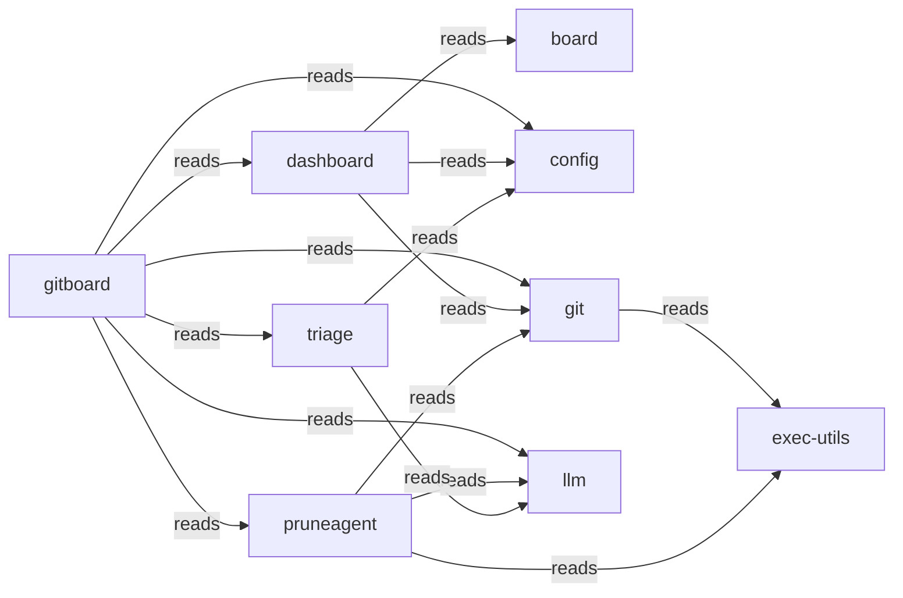

# Typology Architecture Brief

> **Typology seed evidence.** Post-survey/refine architecture brief for this context digest proposal. Not the teaching-story root `architecture.md`, and not the confirmed `.typology/` catalog.

<!-- typology:generated -->

This document is a human-readable projection of the confirmed Typology catalog and the observed Go repository. The catalog remains the machine source of truth. This brief helps people inspect whether the design matches the code.

## How to read this brief

The **intended architecture** comes from the catalog. The **observed topology** comes from the Go import graph. Findings name evidence that needs an agent or architect to fix or record as boundary debt. Typology does not infer a final design decision from a finding.

## Intended architecture

### Bounded-context map

### Bounded contexts

| Slice | Objective | Route |
|-------|-----------|-------|
| `gitboard` | Provides the primary command-line interface and orchestrates core gitboard operations. |  |
| `board` | Manages the core domain logic for project state and board representation. |  |
| `config` | Provides centralized configuration management for the entire system. |  |
| `dashboard` | Serves as the web-based visualization layer for project and board data. |  |
| `git` | Handles all local and remote git repository interactions and state synchronization. |  |
| `llm` | Provides intelligent analysis capabilities through large language model integration. |  |
| `pruneagent` | Automates the identification and execution of project cleanup tasks. |  |
| `triage` | Analyzes project data to categorize and prioritize maintenance actions. |  |
| `exec-utils` | Provides low-level execution primitives and runners for command processing. |  |

### Context details

#### `gitboard`

Provides the primary command-line interface and orchestrates core gitboard operations.

- Packages: ./internal/observability, ./internal/syncproj, ./cmd/gitboard, ./internal/server
- Surfaces: gitboard-cli (cli)
- Programs: _(none)_

#### `board`

Manages the core domain logic for project state and board representation.

- Packages: ./internal/board
- Surfaces: _(none)_
- Programs: _(none)_

#### `config`

Provides centralized configuration management for the entire system.

- Packages: ./internal/config
- Surfaces: _(none)_
- Programs: _(none)_

#### `dashboard`

Serves as the web-based visualization layer for project and board data.

- Packages: ./internal/dashboard
- Surfaces: dashboard-ui (ui)
- Programs: _(none)_

#### `git`

Handles all local and remote git repository interactions and state synchronization.

- Packages: ./internal/localgit, ./internal/remotegit
- Surfaces: _(none)_
- Programs: _(none)_

#### `llm`

Provides intelligent analysis capabilities through large language model integration.

- Packages: ./internal/llm
- Surfaces: _(none)_
- Programs: _(none)_

#### `pruneagent`

Automates the identification and execution of project cleanup tasks.

- Packages: ./internal/pruneagent
- Surfaces: _(none)_
- Programs: _(none)_

#### `triage`

Analyzes project data to categorize and prioritize maintenance actions.

- Packages: ./internal/triage
- Surfaces: _(none)_
- Programs: _(none)_

#### `exec-utils`

Provides low-level execution primitives and runners for command processing.

- Packages: ./internal/cliexec
- Surfaces: _(none)_
- Programs: _(none)_

### Declared coupling

| From | To | Kind |
|------|----|------|
| `gitboard` | `config` | reads |
| `gitboard` | `dashboard` | reads |
| `gitboard` | `git` | reads |
| `gitboard` | `llm` | reads |
| `gitboard` | `pruneagent` | reads |
| `gitboard` | `triage` | reads |
| `dashboard` | `board` | reads |
| `dashboard` | `config` | reads |
| `dashboard` | `git` | reads |
| `git` | `exec-utils` | reads |
| `pruneagent` | `exec-utils` | reads |
| `pruneagent` | `llm` | reads |
| `pruneagent` | `git` | reads |
| `triage` | `config` | reads |
| `triage` | `llm` | reads |

No component bindings are declared.

## Observed topology

The repository contains **13 Go packages** in the inspected modules:
- `./cmd/gitboard`
- `./internal/board`
- `./internal/cliexec`
- `./internal/config`
- `./internal/dashboard`
- `./internal/llm`
- `./internal/localgit`
- `./internal/observability`
- `./internal/pruneagent`
- `./internal/remotegit`
- `./internal/server`
- `./internal/syncproj`
- `./internal/triage`

### High-coupling packages

| Package | In-degree | Out-degree |
|---------|-----------|------------|
| `./cmd/gitboard` | 0 | 11 |
| `./internal/cliexec` | 4 | 0 |
| `./internal/config` | 7 | 0 |
| `./internal/dashboard` | 2 | 4 |
| `./internal/llm` | 3 | 1 |
| `./internal/localgit` | 3 | 1 |
| `./internal/remotegit` | 3 | 3 |
| `./internal/server` | 1 | 4 |

### Leaf packages

Leaf packages have no outgoing local imports. They may be valid infrastructure leaves or packages that should sit inside their only caller.

| Package | Imported by |
|---------|-------------|
| `./internal/board` | 2 |
| `./internal/cliexec` | 4 |
| `./internal/config` | 7 |
| `./internal/observability` | 1 |

### Shared platform leaves

./internal/config

### Merge candidates

These are heuristics for review, not automatic moves.

- `./internal/observability` may sit with `./cmd/gitboard`: sole importer: only imported by ./cmd/gitboard
- `./internal/server` may sit with `./cmd/gitboard`: sole importer: only imported by ./cmd/gitboard
- `./internal/syncproj` may sit with `./cmd/gitboard`: sole importer: only imported by ./cmd/gitboard

## Drift and design questions

The following findings need a correction or an explicit boundary-debt decision:

- `git`: SliceBinding git -> board missing but cross-slice import exists (internal-remotegit -> internal-board)
- `git`: SliceBinding git -> config missing but cross-slice import exists (internal-remotegit -> internal-config)
- `gitboard`: SliceBinding gitboard -> exec-utils missing but cross-slice import exists (cmd-gitboard -> internal-cliexec)
- `llm`: SliceBinding llm -> config missing but cross-slice import exists (internal-llm -> internal-config)

## Agent review protocol

1. Read the relevant catalog rows and the evidence named by each finding.
2. Fix the code or catalog when the boundary is wrong.
3. Record a temporary boundary decision in the Typology journey when the design needs a later refactor.
4. Re-run `typology architecture REPO` and `typology validate REPO`.
5. Remove the generated marker only after a human accepts the narrative as a reviewed explanation.
