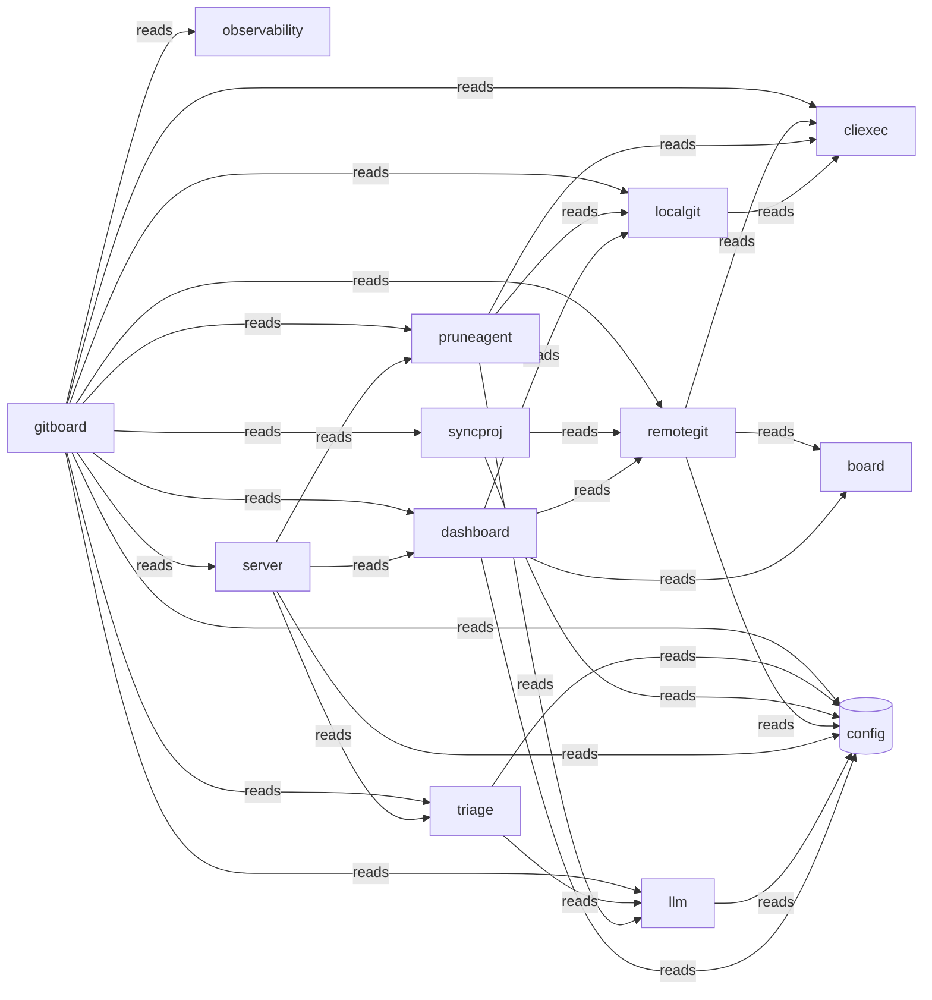

# Typology Architecture Brief

<!-- majordomo-reading-nav:start -->
**Reading path:** [Prev: README.md](README.md) · [Next: journey.md](journey.md) · [TOC](README.md)
<!-- majordomo-reading-nav:end -->

> **Typology seed evidence.** Post-survey/refine architecture brief for this context digest proposal. Not the teaching-story root `architecture.md`, and not the confirmed `.typology/` catalog.

<!-- typology:generated -->

This document is a human-readable projection of the confirmed Typology catalog and the observed Go repository. The catalog remains the machine source of truth. This brief helps people inspect whether the design matches the code.

## How to read this brief

The **intended architecture** comes from the catalog. The **observed topology** comes from the Go import graph. Findings name evidence that needs an agent or architect to fix or record as boundary debt. Typology does not infer a final design decision from a finding.

## Intended architecture

### Bounded-context map

### Bounded contexts

| Slice | Objective | Route |
|-------|-----------|-------|
| `board` | Provide JSON data types shared across the dashboard UI, forge adapters, and server handlers. |  |
| `cliexec` | Executes external processes via the os/exec package. |  |
| `dashboard` | The dashboard package aggregates various views and investigation results for the system. |  |
| `gitboard` | Acts as the command-line entrypoint to orchestrate the gitboard application. |  |
| `llm` | Provides an OpenAI-compatible chat completions client. |  |
| `localgit` | Provides mechanisms to inspect local git state and populate metadata for checkout operations. |  |
| `observability` | Bootstraps OTEL and manages error-only inference dumps. |  |
| `pruneagent` | The package investigates local-only or likely-removable branches. |  |
| `remotegit` | Provides clients for interacting with remote Git forge APIs like GitHub and GitLab. |  |
| `server` | Provides an HTTP server interface and mux routing for the application. |  |
| `syncproj` | Aggregates views for project discovery and selection. |  |
| `triage` | Analyzes project and job data to produce triage responses. |  |

### Libraries

Technical packages with no domain knowledge. They claim packages without a product objective.

| Library | Purpose | Packages |
|---------|---------|----------|
| `config` | Shared technical package without domain knowledge | internal/config |

### Context details

#### `board`

Provide JSON data types shared across the dashboard UI, forge adapters, and server handlers.

- Packages: internal/board
- Surfaces: _(none)_
- Programs: _(none)_

#### `cliexec`

Executes external processes via the os/exec package.

- Packages: internal/cliexec
- Surfaces: _(none)_
- Programs: _(none)_

#### `dashboard`

The dashboard package aggregates various views and investigation results for the system.

- Packages: internal/dashboard
- Surfaces: _(none)_
- Programs: _(none)_

#### `gitboard`

Acts as the command-line entrypoint to orchestrate the gitboard application.

- Packages: cmd/gitboard
- Surfaces: gitboard-cli (cli)
- Programs: _(none)_

#### `llm`

Provides an OpenAI-compatible chat completions client.

- Packages: internal/llm
- Surfaces: _(none)_
- Programs: _(none)_

#### `localgit`

Provides mechanisms to inspect local git state and populate metadata for checkout operations.

- Packages: internal/localgit
- Surfaces: _(none)_
- Programs: _(none)_

#### `observability`

Bootstraps OTEL and manages error-only inference dumps.

- Packages: internal/observability
- Surfaces: _(none)_
- Programs: _(none)_

#### `pruneagent`

The package investigates local-only or likely-removable branches.

- Packages: internal/pruneagent
- Surfaces: _(none)_
- Programs: _(none)_

#### `remotegit`

Provides clients for interacting with remote Git forge APIs like GitHub and GitLab.

- Packages: internal/remotegit
- Surfaces: _(none)_
- Programs: _(none)_

#### `server`

Provides an HTTP server interface and mux routing for the application.

- Packages: internal/server
- Surfaces: server-ui (ui)
- Programs: _(none)_

#### `syncproj`

Aggregates views for project discovery and selection.

- Packages: internal/syncproj
- Surfaces: _(none)_
- Programs: _(none)_

#### `triage`

Analyzes project and job data to produce triage responses.

- Packages: internal/triage
- Surfaces: _(none)_
- Programs: _(none)_

### Declared coupling

| From | To | Kind |
|------|----|------|
| `dashboard` | `board` | reads |
| `dashboard` | `config` | reads |
| `dashboard` | `localgit` | reads |
| `dashboard` | `remotegit` | reads |
| `llm` | `config` | reads |
| `localgit` | `cliexec` | reads |
| `pruneagent` | `cliexec` | reads |
| `pruneagent` | `llm` | reads |
| `pruneagent` | `localgit` | reads |
| `server` | `config` | reads |
| `server` | `dashboard` | reads |
| `server` | `pruneagent` | reads |
| `server` | `triage` | reads |
| `remotegit` | `board` | reads |
| `remotegit` | `cliexec` | reads |
| `remotegit` | `config` | reads |
| `syncproj` | `config` | reads |
| `syncproj` | `remotegit` | reads |
| `triage` | `config` | reads |
| `triage` | `llm` | reads |
| `gitboard` | `cliexec` | reads |
| `gitboard` | `config` | reads |
| `gitboard` | `dashboard` | reads |
| `gitboard` | `llm` | reads |
| `gitboard` | `localgit` | reads |
| `gitboard` | `observability` | reads |
| `gitboard` | `pruneagent` | reads |
| `gitboard` | `remotegit` | reads |
| `gitboard` | `server` | reads |
| `gitboard` | `syncproj` | reads |
| `gitboard` | `triage` | reads |

Bindings may target a slice or a library. `from` is always a slice.

No component bindings are declared.

## Observed topology

The repository contains **13 Go packages** in the inspected modules:
- `./cmd/gitboard`
- `./internal/board`
- `./internal/cliexec`
- `./internal/config`
- `./internal/dashboard`
- `./internal/llm`
- `./internal/localgit`
- `./internal/observability`
- `./internal/pruneagent`
- `./internal/remotegit`
- `./internal/server`
- `./internal/syncproj`
- `./internal/triage`

### High-coupling packages

| Package | In-degree | Out-degree |
|---------|-----------|------------|
| `./cmd/gitboard` | 0 | 11 |
| `./internal/cliexec` | 4 | 0 |
| `./internal/config` | 7 | 0 |
| `./internal/dashboard` | 2 | 4 |
| `./internal/llm` | 3 | 1 |
| `./internal/localgit` | 3 | 1 |
| `./internal/remotegit` | 3 | 3 |
| `./internal/server` | 1 | 4 |

### Leaf packages

Leaf packages have no outgoing local imports. They may be valid infrastructure leaves or packages that should sit inside their only caller.

| Package | Imported by |
|---------|-------------|
| `./internal/board` | 2 |
| `./internal/cliexec` | 4 |
| `./internal/config` | 7 |
| `./internal/observability` | 1 |

### Shared platform leaves

./internal/config

### Merge candidates

These are heuristics for review, not automatic moves.

- `./internal/observability` may sit with `./cmd/gitboard`: sole importer: only imported by ./cmd/gitboard
- `./internal/server` may sit with `./cmd/gitboard`: sole importer: only imported by ./cmd/gitboard
- `./internal/syncproj` may sit with `./cmd/gitboard`: sole importer: only imported by ./cmd/gitboard

## Drift and design questions

No catalog, path, import, or documentation findings were reported.

## Agent review protocol

1. Read the relevant catalog rows and the evidence named by each finding.
2. Fix the code or catalog when the boundary is wrong.
3. Record a temporary boundary decision in the Typology journey when the design needs a later refactor.
4. Re-run `typology architecture REPO` and `typology validate REPO`.
5. Remove the generated marker only after a human accepts the narrative as a reviewed explanation.
